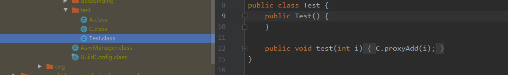

### 功能介绍

RoboAsm自动化插桩框架，提供了一种简单易用、无侵入、注解配置化、轻量级的 Java 字节码操作方式，只需要在Java 代码中添加注解，即可实现编译期对 Class 文件的动态修改。

对标市场一线DroidAssist框架,进行了以下提升:
1. 处理速度极限优化,一个transform任务处理所有的任务,增强asm框架添加预读导包功能，仅在匹配到规则的class文件才会进行全读.
2. 极简的使用,无须配置,一行注解自动帮你建立自动化插桩任务。
3. 结合AOP思想，再次抽象，提纯。所有逻辑均在方法中,RoboAsm框架帮你拿到方法,至于要做什么,交给调用者自己实现.比如方法扩展，增加。比如
修复bug，排除bug，方法耗时统计，性能监控，添加自己所有想要的逻辑。


### 功能组成

RoboAsm插桩框架组成分为3大功能:

==1.== 方法调用替换，所有调用处替换。比如：所有调用A.b()，改为C.b()。细分为：静态方法调用替换，实例方法调用替换。

==2.==  方法实现替换，单个方法替换。比如：A.b()的实现，改为C.b()。细分为：静态方法实现替换，实例方法实现替换。

==3.== 方法添加trycatch，单个方法添加。比如：A.b()的代码块添加try catch。细分为：静态方法添加trycatch，实例方法添加trycatch。

> 方法调用替换&方法实现替换区别:

> 方法调用替换是针对没有方法的实现源码，是所有调用处替换。比如Log.i(),Log是系统自带类,我们没有Log.i()的实现源码,所以只能用方法调用替换。
方法实现替换是针对有方法实现的源码，是单个方法替换。比如MyLog.i(),MyLog是我们自己的类,有实现源码,所以可以用方法实现替换。


### 功能详解

1. 方法调用替换
* 将所有对A类的静态方法A.b(...)的调用，改为调用 C类的静态方法 C.b(...), 其中 A.b(...) 和 C.b(...) 参数完全一致
* 将所有对A类的实例方法A.b(...)的调用，改为调用 C类的静态方法 C.b(A, ...), 其中 C.b(...) 的一个参数类型是A，后续参数和 A.b(...)的参数完全一致

2. 方法实现替换

* 将A类的静态方法A.b(...)的实现，改为调用 C类的静态方法 C.b(...), 其中 A.b(...) 和 C.b(...) 参数完全一致

* 将A类的非静态方法A.b(...)的实现，改为调用 C类的静态方法 C.b(A, ...), 其中 C.b(...) 的一个参数类型是A，后续参数和 A.b(...)的参数完全一致

3. 方法添加trycatch

* 将A类的静态方法A.b(...)的实现，添加try catch,并在异常时返回调用 C类的静态方法 C.b(..., Exception e), 其中 A.b(...) 和 C.b(..., Exception e) 前面参数完全一致,最后一个必须是Exception

* 将A类的非静态方法A.b(...)的实现，添加try catch,并在异常时返回调用C类的静态方法 C.b(A, ..., Exception e), 其中 C.b(A, ..., Exception e) 的第一个参数类型是A，最后一个参数是Exception,中间的参数完全一致

注意： 类和方法路径一定要keep，不能混淆，否则签名失败，启动崩溃。

### 使用详解

1. 手动配置任务规则,创建app/RoboAsmConfig.xml配置规则如下

```
<?xml version="1.0" encoding="utf-8"?>
<configuration>
<!-- SkipClass 指定包名跳过所有的处理 -->
<SkipClass>com.baidu</SkipClass>
<SkipClass>com.google</SkipClass>

<!-- ReplaceMethodInvoke 替换方法调用 -->
<ReplaceMethodInvoke>
<!-- className 待替换的类名 -->
<!-- className 正常情况需要明确指出，替换成的类必须是：包名+类名 -->
<!-- className 特殊情况可省略，若省略则表示：不限制类，方法名称和方法签名一致的都进行替换 -->
<className>com.example.Test</className>

<!-- methodName 待替换的方法名称 -->
<!-- methodName 不可省略，大小写必须一致 -->
<methodName>add</methodName>

<!-- methodDescriptor 待替换的方法描述 -->
<!-- methodDescriptor 不可省略，可以通过 ASM Bytecode Viewer IDE插件工具,用来查看方法签名. -->
<methodDescriptor>(Ljava/lang/String;Ljava/lang/String;)I</methodDescriptor>

<!-- replaceClassName 替换类为 -->
<!-- replaceClassName 不可省略，替换成的类必须是：包名+类名 -->
<replaceClassName>com.example.ProxyTest</replaceClassName>

<!-- replaceMethodName 替换方法为 -->
<!-- replaceMethodName 若省略，表示和 <methodName>一致 -->
<replaceMethodName>proxyAdd</replaceMethodName>

<!-- replaceMethodDescriptor 替换方法描述为 -->
<!-- replaceMethodDescriptor 若省略，表示和 <methodDescriptor>一致 -->
<replaceMethodDescriptor>(Ljava/lang/String;Ljava/lang/String;)I</replaceMethodDescriptor>

<!-- skipClassName 限定类跳过本次处理 -->
<!-- skipClassName 可以省略，默认含有 <replaceMethodName>，若多个用#进行拼接，比如com.A#com.B -->
<skipClassName>com.example.ProxyTest</skipClassName>

<!-- excludeClassName 不限制类名但排除限定类，特殊情况下使用-->
<!-- excludeClassName 仅在<className>省略情况下生效 -->
<!-- excludeClassName 比如所有调用 int add（String p0,String p1）的地方都进替换，但排除掉proxyTest.add（"p0","p1"）-->
<excludeClassName>com.example.ProxyTest</excludeClassName>
</ReplaceMethodInvoke>

<!-- ReplaceMethodCode 替换方法实现 -->
<ReplaceMethodCode>
<!-- className 待替换的类名 -->
<!-- className 不可省略，需明确指出：包名+类名 -->
<className>com.example.Test</className>
<!-- methodName 待替换的方法名 -->
<!-- methodName 不可省略，大小写必须一致-->
<methodName>add</methodName>

<!-- methodDescriptor 待替换的方法描述 -->
<!-- methodDescriptor 不可省略，可以通过 ASM Bytecode Viewer IDE插件工具,用来查看方法签名. -->
<methodDescriptor>(Ljava/lang/String;Ljava/lang/String;)I</methodDescriptor>

<!-- interrupt 是否中断后续执行 -->
<!-- interrupt 若省略，表示中断后续执行 -->
<interrupt>true</interrupt>

<!-- ReplaceClassName 替换类为 -->
<!-- ReplaceClassName 不可省略，替换成的类必须是：包名+类名 -->
<replaceClassName>com.example.Test</replaceClassName>

<!-- ReplaceMethodName 替换方法为 -->
<!-- ReplaceMethodName 若省略，表示和 <methodName>一致 -->
<replaceMethodName>com.example.Test</replaceMethodName>

<!-- replaceMethodDescriptor 替换方法描述为 -->
<!-- replaceMethodDescriptor 若省略，表示和 <methodDescriptor>一致 -->
<replaceMethodDescriptor>(Ljava/lang/String;Ljava/lang/String;)I</replaceMethodDescriptor>
</ReplaceMethodCode>

<TryCatchMethod>
<!-- className 要添加try catch的类名 -->
 <className>com.mbridge.msdk.video.module.MBridgeVideoView$b</className>

<!-- methodName 要添加try catch的方法名称 -->
 <methodName>onPlayError</methodName>

 <!-- methodDescriptor 要添加try catch的方法描述 -->
 <methodDescriptor>(Ljava/lang/String;)V</methodDescriptor>

<!-- throwClassName 类名, 在方法发生异常时, 将返回调用方法的值, 该方法所在的类名称, -->
 <throwClassName>org.trade.roboasmdemo.FixMBridgeVideoView$b</throwClassName>

 <!-- throwMethodName 方法的名称, 在方法发生异常时, 将返回调用方法的名称-->
<throwMethodName>proxyOnPlayError</throwMethodName>

<!-- throwMethodName 方法的描述, 在方法发生异常时, 将返回调用方法的方法的描述-->
<throwMethodDescriptor>(Ljava/lang/Object;Ljava/lang/String;Ljava/lang/Exception;)V</throwMethodDescriptor>
</TryCatchMethod>

</configuration>
```


2. 注解自动生成任务规则(注解自动生成app/RoboAsmConfigGen.xml任务规则文件)
@
* ReplaceMethodInvoke 

  方法实现替换,在方法上添加注解eg:
  
  ```@ReplaceMethodInvoke(className = "com.example.A", methodName = "add", isStatic = true)```


@ReplaceMethodCode 方法调用替换,在方法上添加注解eg:

```
@ReplaceMethodCode(className = "com.example.A", methodName = "add", isStatic = false)
```


@TryCatchMethod 方法添加trycatch,在方法上添加注解eg:

```@TryCatchMethod (className = "com.example.A", methodName = "add", isStatic = false)```


@SkipClass 指定包名跳过所有的处理,在类似添加注解,eg:

```
@SkipClass(packageName = "com.google#com.baidu")

```


### 接入案例

1. 静态方法调用替换

* 注意方法的参数和返回值一定要按照功能详解的描述设置
* 类和方法一定要keep，不能混淆，否则签名失败，启动崩溃。


构建时,自动生成配置文件 app/RoboAsmConfigGen.xml
```
<?xml version="1.0" encoding="utf-8"?>
<configuration>

 <ReplaceMethodInvoke>
   <className>com.example.A</className>
   <methodName>add</methodName>
   <methodDescriptor>(I)I</methodDescriptor>
   <replaceClassName>com.example.C</replaceClassName>
   <replaceMethodName>proxyAdd</replaceMethodName>
 </ReplaceMethodInvoke>

</configuration>
```

构建后确认,在build\intermediates\javac查看




2. 非静态方法调用替换
* 注意方法的参数和返回值一定要按照功能详解的描述设置
* 类和方法一定要keep，不能混淆，否则签名失败，启动崩溃。


构建时,自动生成配置文件 app/RoboAsmConfigGen.xml
```
<?xml version="1.0" encoding="utf-8"?>
<configuration>
   <ReplaceMethodInvoke>
        <className>com.example.A</className>
        <methodName>add</methodName>
        <methodDescriptor>(I)I</methodDescriptor>
        <replaceClassName>com.example.C</replaceClassName>
        <replaceMethodName>proxyAdd</replaceMethodName>
        <replaceMethodDescriptor>(Lcom/example/A;I)I</replaceMethodDescriptor>
  </ReplaceMethodInvoke>

</configuration>
```
构建后确认,在build\intermediates\javac查看


3.静态方法实现替换
* 注意方法的参数和返回值一定要按照功能详解的描述设置
* 类和方法一定要keep，不能混淆，否则签名失败，启动崩溃。


构建时,自动生成配置文件 app/RoboAsmConfigGen.xml

```
<?xml version="1.0" encoding="utf-8"?>
<configuration>
 
   <ReplaceMethodCode>
       <className>com.example.A</className>
       <methodName>add</methodName>
       <methodDescriptor>(I)I</methodDescriptor>
       <paramNum>1</paramNum>
       <ReplaceClassName>com.example.C</ReplaceClassName>
       <ReplaceMethodName>proxyAdd</ReplaceMethodName>
   </ReplaceMethodCode>

</configuration>
```

构建后确认,在build\intermediates\javac查看


4.非静态方法实现替换
* 注意方法的参数和返回值一定要按照功能详解的描述设置
* 类和方法一定要keep，不能混淆，否则签名失败，启动崩溃。


构建时,自动生成配置文件 app/RoboAsmConfigGen.xml

```
<?xml version="1.0" encoding="utf-8"?>
<configuration>
 
  <ReplaceMethodCode>
    <className>com.example.A</className>
    <methodName>add</methodName>
    <methodDescriptor>(I)I</methodDescriptor>
    <paramNum>1</paramNum>
    <ReplaceClassName>com.example.C</ReplaceClassName>
    <ReplaceMethodName>proxyAdd</ReplaceMethodName>
    <replaceMethodDescriptor>(Lcom/example/A;I)I</replaceMethodDescriptor>
  </ReplaceMethodCode>

</configuration>
```

构建后确认,在build\intermediates\javac查看


5.非静态方法添加try catch
* 注意方法的参数和返回值一定要按照功能详解的描述设置
* 类和方法一定要keep，不能混淆，否则签名失败，启动崩溃。


构建时,自动生成配置文件 app/RoboAsmConfigGen.xml
```
<?xml version="1.0" encoding="utf-8"?>
<configuration>
 
  <TryCatchMethod>
     <className>org.trade.roboasmdemo.A</className>
     <methodName>add</methodName>
     <methodDescriptor>(I)I</methodDescriptor>
     <throwClassName>org.trade.roboasmdemo.C</throwClassName>
     <throwMethodName>proxyAdd</throwMethodName>
     <throwMethodDescriptor>(Lorg/trade/roboasmdemo/A;ILjava/lang/Exception;)I</throwMethodDescriptor>
  </TryCatchMethod>

</configuration>
```
构建后确认,在build\intermediates\javac查看


